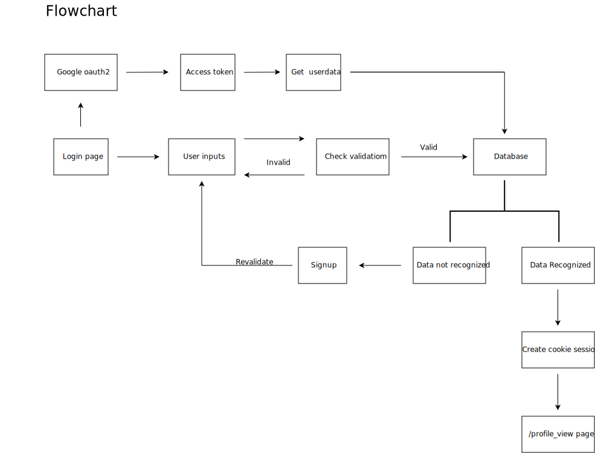

# Fullstack_adya_roby

Clone repo:

```bash
git clone https://github.com/Ar37-rs/fullstack_adya_roby.git
cd fullstack_adya_roby
```

How to run (the SPA and database/sqlite3 are already included and configured):

```bash
cd fullstack_go_backend
go mod tidy
go run main.go
```

and then open http://localhost:1323


