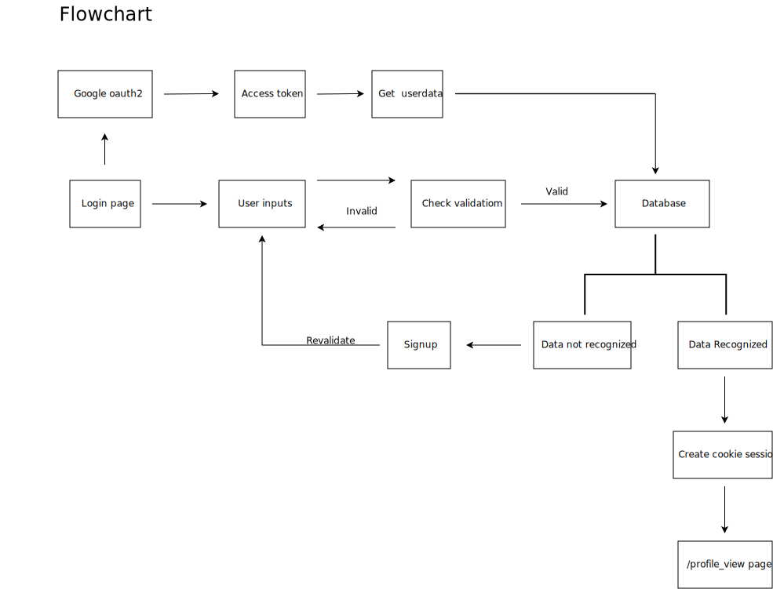

# Login page + google oauth2 

[](https://github.com/Ar37-rs/login_page_plus_oauth2/actions/workflows/go.yml)

Clone repo:

```bash
git clone https://github.com/Ar37-rs/login_page_plus_oauth2.git
cd login_page_plus_oauth2
cd backend
```

A note, before running:<br />
Change the empty client_id and client_secret strings inside main.go file according to your GA ClientID and ClientSecret,<br />
and also you have to add the url: http://localhost:1323/auth/oauth2 as one of your Authorised redirect URIs on your GA credential config.<br />
for more info visit: https://console.cloud.google.com/apis/credentials

How to run (the SPA and database/sqlite3 are already included and configured):

```bash
go mod tidy
go run main.go
```

and then open http://localhost:1323


